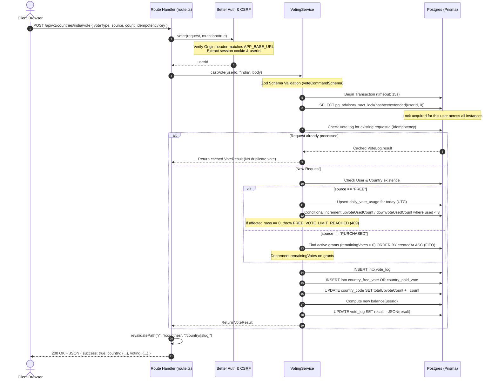
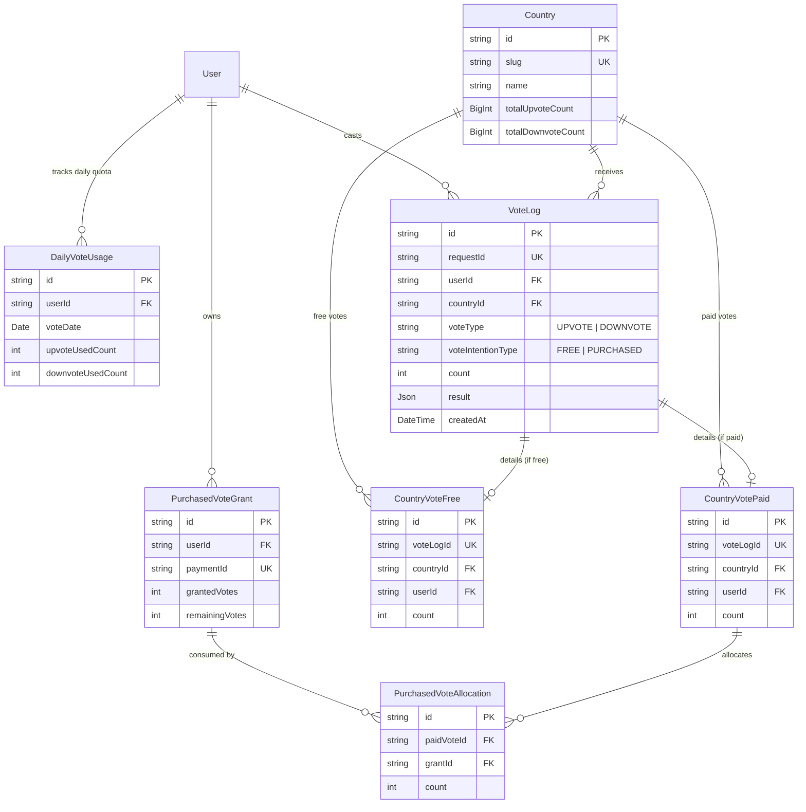

# CountryRank Voting System — Technical Specification & Architecture

## 1. System Overview

CountryRank allows authenticated users to influence sovereign nation rankings via an immutable, double-entry style voting ledger. The system balances spam deterrence, strict daily allowances, paid voting credits, high-concurrency race protection, and responsive user interaction.

```
                      ┌───────────────────────────────────────┐
                      │            Frontend Layer             │
                      │   - VotingPanel (Country Detail)      │
                      │   - LeaderboardVoteActions (Table)    │
                      │   - useVoting Hook (State & Retries)  │
                      └──────────────────┬────────────────────┘
                                         │ POST /api/v1/countries/:slug/vote
                                         │ (JSON + Idempotency Key)
                                         ▼
                      ┌───────────────────────────────────────┐
                      │               API Layer               │
                      │   - CSRF / Origin Validation          │
                      │   - Better Auth Session Extraction    │
                      │   - Sliding Window Rate Limiting      │
                      └──────────────────┬────────────────────┘
                                         │
                                         ▼
                      ┌───────────────────────────────────────┐
                      │        Voting Service Layer           │
                      │   - PostgreSQL Advisory Lock          │
                      │   - Idempotency & Replay Cache Check  │
                      │   - Daily Quota vs. FIFO Paid Grants  │
                      │   - Ledger Entries + Atomic Increment │
                      └──────────────────┬────────────────────┘
                                         │
                                         ▼
                      ┌───────────────────────────────────────┐
                      │            Database Layer             │
                      │   - vote_log (master append ledger)   │
                      │   - country_free_vote / paid_vote     │
                      │   - daily_vote_usage (UTC date)       │
                      │   - country_code (totals)             │
                      └───────────────────────────────────────┘
```

---

## 2. Core Business Rules

1. **Daily Free Allowance**:
   - Each authenticated user receives **3 free Upvotes** and **3 free Downvotes** per UTC calendar day.
   - Upvotes and downvotes have independent quotas (`upvoteUsedCount` and `downvoteUsedCount` in `daily_vote_usage`).
   - Free votes strictly reset at `00:00:00 UTC` every day.
2. **Paid Voting Credits**:
   - Users can purchase vote grants via completed payments.
   - Paid votes are drawn in **FIFO (First-In, First-Out)** order from `purchased_vote_grant`.
   - Each vote deducts from the earliest active grant until `remainingVotes == 0`.
3. **Immutability & Audit Trail**:
   - Votes cannot be retracted or edited. Every vote event generates an append-only ledger record (`VoteLog`), paired with either a `CountryVoteFree` or `CountryVotePaid` breakdown.
   - Country aggregates (`totalUpvoteCount`, `totalDownvoteCount`) are stored as unsigned 64-bit BigInts on `Country` and atomically incremented.
4. **Idempotency**:
   - All vote mutations must provide a client-generated UUID (`idempotencyKey`).
   - If a request is retried (e.g. network timeout or double-click), the backend detects the existing `requestId` in `VoteLog` and returns the previously committed result without double-voting.
5. **Concurrency Safety**:
   - PostgreSQL transaction advisory locks (`pg_advisory_xact_lock(hashtextextended(userId, 0))`) serialize all voting operations for a single user, preventing parallel race condition bypasses.

---

## 3. Frontend Architecture

### 3.1 Components

The frontend provides two distinct voting surfaces:

#### 1. Detailed Country View — [`VotingPanel`](file:///c:/Users/bhara/Pictures/coutnry/country-ranker/apps/client/src/components/voting/voting-panel.tsx)
- Located on `/country/[slug]`.
- Displays real-time breakdown of:
  - Remaining free upvotes today (out of 3)
  - Remaining free downvotes today (out of 3)
  - Remaining paid vote credits
  - UTC reset countdown indicator
- Features full optimistic feedback, animated status transitions (using Framer Motion), and disabled states when quotas are exhausted.

#### 2. Leaderboard Table View — [`LeaderboardVoteActions`](file:///c:/Users/bhara/Pictures/coutnry/country-ranker/apps/client/src/components/voting/leaderboard-vote-actions.tsx)
- Rendered on every country row on the main ranking table (`/` and `/countries`).
- Streamlined compact green `▲` (Upvote) and red `▼` (Downvote) buttons.
- If an unauthenticated user clicks vote, fires a synthetic DOM event `country-rank:open-sign-in` to trigger the Google auth modal.
- Provides immediate visual pulse, loader spinner, and in-place floating alerts for rate limits or quota depletion.

---

### 3.2 State Management & Hook: [`useVoting`](file:///c:/Users/bhara/Pictures/coutnry/country-ranker/apps/client/src/hooks/use-voting.ts)

The `useVoting` hook abstracts the interaction with the voting endpoints:

```typescript
export function useVoting({ slug, initialUpvotes, initialDownvotes }: UseVotingOptions) {
  // 1. Quota balance cache
  const [balance, setBalance] = useState<VoteBalance | null>(null);
  
  // 2. Authoritative country vote counters
  const [upvotes, setUpvotes] = useState(initialUpvotes);
  const [downvotes, setDownvotes] = useState(initialDownvotes);

  // 3. Retry-safe idempotency tracking
  const pendingKeyRef = useRef<string | null>(null);
  const pendingVoteRef = useRef<{ voteType: VoteType; source: VoteSource; count: number } | null>(null);
```

#### Idempotency Key Lifecycle:
1. When `castVote("UPVOTE")` is invoked:
   - Check if this is a retry of an existing in-flight request (`isRetry`).
   - If fresh: generates a new `UUIDv4` stored in `pendingKeyRef.current`.
   - If retry: retains the identical `pendingKeyRef.current`.
2. Upon HTTP 200 (Success):
   - Updates local counters with authoritative numbers from server.
   - Clears `pendingKeyRef.current = null`.
3. Upon Network Failure:
   - Keeps `pendingKeyRef.current` intact so that user clicks retry with the exact same key.
4. Upon Client Error (4xx non-retryable):
   - Clears key to allow the user to make a different action.

---

## 4. Backend Architecture & API Layer

### 4.1 Endpoints

| Method | Path | Auth Required | Description |
| :--- | :--- | :--- | :--- |
| `POST` | `/api/v1/countries/[slug]/vote` | **Yes** (Origin + Session) | Submits a vote for a country |
| `GET` | `/api/v1/votes/me` | **Yes** (Session) | Returns current user balance & quota |
| `GET` | `/api/v1/votes/history` | **Yes** (Session) | Returns paginated list of user's past votes |

---

### 4.2 Vote Submission Pipeline (`POST /api/v1/countries/[slug]/vote`)



---

### 4.3 Transaction Locking & Concurrency Control

To prevent race conditions where a user spams parallel HTTP requests to exceed their daily 3-vote limit:
1. **Advisory Locks**:
   ```sql
   SELECT pg_advisory_xact_lock(hashtextextended(${userId}, 0));
   ```
   - Uses PostgreSQL's built-in transaction-level advisory locks.
   - Scope is restricted to the specific `userId` using a 64-bit hash.
   - Automatically released when the transaction commits or aborts.
2. **Conditional Updates**:
   - Daily quotas are incremented using atomic conditional SQL:
     ```prisma
     tx.dailyVoteUsage.updateMany({
       where: { userId, voteDate, upvoteUsedCount: { lt: DAILY_FREE_VOTES } },
       data: { upvoteUsedCount: { increment: 1 } }
     })
     ```
   - If two operations somehow execute concurrently, only the one where `upvoteUsedCount < 3` succeeds; the other affects 0 rows and triggers `FREE_VOTE_LIMIT_REACHED`.

---

### 4.4 Rate Limiting & Abuse Prevention

Implemented in [`vote-http.ts`](file:///c:/Users/bhara/Pictures/coutnry/country-ranker/apps/client/src/server/voting/vote-http.ts):
- Stored centrally in the `vote_rate_limit` PostgreSQL table.
- Shared across all serverless instances and worker pods.
- Employs a 1-minute sliding window with `ON CONFLICT DO UPDATE`.
- Limits individual users to **30 requests per minute**. Excess calls receive `429 Too Many Requests`.

---

## 5. Database Schema & Data Models



---

## 6. Error Handling & HTTP Status Codes

| Error Code | Status | Trigger Condition | User Remedy |
| :--- | :--- | :--- | :--- |
| `UNAUTHORIZED` | 401 | User session missing or expired | Sign in with Google |
| `FORBIDDEN_ORIGIN` | 403 | `Origin` header does not match application domain | Use official website |
| `EMAIL_NOT_VERIFIED` | 403 | Verification enforced and email unverified | Verify email address |
| `COUNTRY_NOT_FOUND` | 404 | Given `slug` does not exist | Check URL / slug |
| `FREE_VOTE_LIMIT_REACHED` | 409 | User has consumed all 3 free up/downvotes for today | Wait for 00:00 UTC reset or purchase credits |
| `INSUFFICIENT_PURCHASED_VOTES`| 409 | User attempted paid vote without sufficient balance | Purchase a vote pack |
| `IDEMPOTENCY_CONFLICT` | 409 | Reused `idempotencyKey` with differing vote payload | Generate fresh key |
| `INVALID_VOTE` | 422 | Zod validation failed (e.g. invalid direction or count) | Check payload syntax |
| `RATE_LIMITED` | 429 | Exceeded 30 requests / minute | Wait 60 seconds |
| `INTERNAL_SERVER_ERROR` | 500 | Database connectivity or unhandled error | Retry with same idempotency key |
